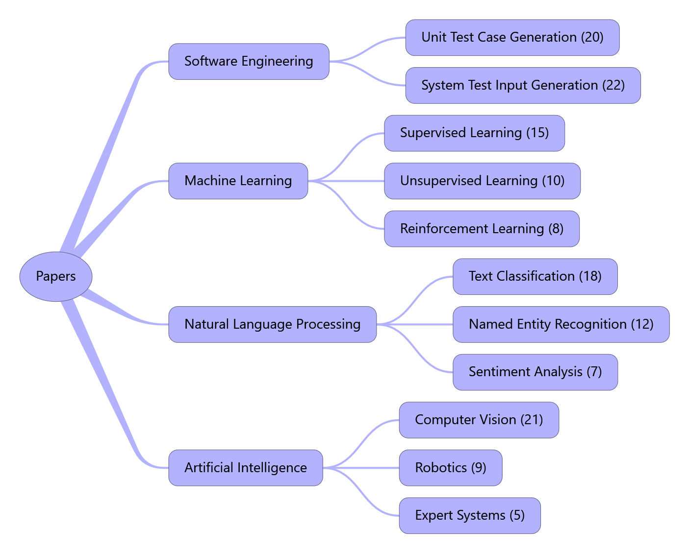

# Papers📕

Papers in various fields.

## 🎊Recent Updates🎊

​	来表示最近新添加的论文，表示最近一周新添加的内容。

- [Codet: Code Generation with Generated Tests](https://openreview.net/pdf?id=ktrw68Cmu9c) (in ICLR 2023)

## Software Engineering

### Unit Test Case Generation(20)

- [Codet: Code Generation with Generated Tests](https://openreview.net/pdf?id=ktrw68Cmu9c) (in ICLR 2023)

### System Test Input Generation(22)

- 

- \[方括号填写论文名称，小括号填写论文地址\]\(填写论文地址\)(这里填写会议/期刊 + 年份)---最后把转义符号'\'删掉

## Machine Learning

### Supervised Learning(15)

- 

### Unsupervised Learning(10)

- 

### Reinforcement Learning(8)

- 

……如果有需要将汇报所用PPT等其他材料保存的话，可在Resources下对应目录中，创建一个文件夹名为对应论文题目的文件夹，并将相关资料保存其中
