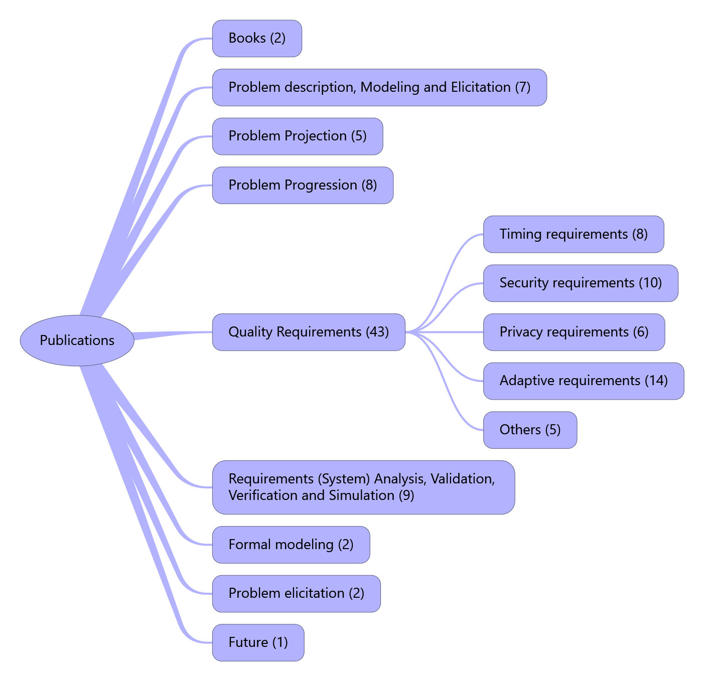

# Publications📕

## Overview📃

## 🎊Recent Updates🎊

​	This section is used to record the papers updated in the past week.

## Book(2)

- Zhi Jin. [Environment Modeling-Based Requirements Engineering for Software Intensive Systems ](http://cds.cern.ch/record/2300486)，1st Edition, Morgan Kaufmann, 2018.
- M. Jackson, [Problem Frames: Analyzing and Structuring software development problems, ](https://dl.acm.org/citation.cfm?id=513720)Addison-Wesley, 2001.

## Problem description, Modeling and Elicitation(7)

- Xiaohong Chen, Zhi Jin. [Capturing Software Requirements From the Expected Interactions Between the Software and its Environment: an Ontology based Approach. ](https://www.worldscientific.com/doi/pdf/10.1142/S0218194016500029)International Journal of Software Engineering and Knowledge Engineering, 26(1): 15-39, 2016.(SCI)
- Xiaohong Chen, Haiying Sun, Ronghua Ye, Jing Liu. [Problem Frames Construction from Feature Models. ](https://ieeexplore.ieee.org/document/6805403)APSEC2013, 2013, pp. 164-171.
- Xiaohong Chen, Zhi Jin, and Bin Yin, [An approach for capturing software requirments from interactive scenarios, ](http://cjc.ict.ac.cn/quanwenjiansuo/2011-2/cxh.pdf)Chinese Journal of Computers, 34(2):329-341,2011, (in Chinese).
- Xiaohong Chen, Bin Yin, and Zhi Jin, [Ontology- guided requirements modeling based on problem frames approach, ](http://www.jos.org.cn/jos/ch/reader/create_pdf.aspx?file_no=3755&journal_id=jos)Journal of Software,22(2):177-195,2011, (in Chinese).
- Xiaohong Chen, Bin Yin, Zhi Jin. [DPTool: A Tool for Guiding the Problem Description and the Problem Projection. ](https://ieeexplore.ieee.org/document/5636576)18th IEEE International Requirements Engineering Conference, 2010, pp. 401-402.
- Xiaohong Chen, and Zhi Jin. [An Ontology-guided Process for Developing Problem Frame Specification: An Example. ](https://www.researchgate.net/publication/247927780_An_ontology-guided_process_for_developing_problem_frame_specification_An_example)Proceedings of the 3rd International Workshop on Applications and Advances of Problem Frames, IWAAPF'08 , pp. 36-39, 2008.
- Xiaohong Chen, Zhi Jin, and Lijun Yi. [An Ontology of Problem Frames for Guiding Problem Frame Specification. ](https://link.springer.com/chapter/10.1007%2F978-3-540-76719-0_38)Proceedings of Knowledge Science, Engineering and Management - Second International Conference, KSEM 2007. Lecture Notes in Computer Science, v 4798 LNAI, pp. 84-395, 2007.

## Problem Projection(5)

- Zhengheng Yuan, Xiaohong Chen*, JingLiu, Yijun Yu, Haiying Sun, Tingliang Zhou, Zhi Jin. [Simplifying the Formal Verification of Safety Requirements in Zone Controllers through Problem Frames and Constraints based Projection. ](https://ieeexplore.ieee.org/document/8481403)IEEE Transaction on IntelligentTransportation System. 2018, 19(11):3517 – 3528
- Ziyan Zhao, Zhi Li, Changlan Fu, and Xiao Zhang. [A Computer-aided Modeling and Verification Approach for Problem-oriented Software Development. ](http://kns.cnki.net/kns/download.aspx?filename=uZXO1dGaLFGOap3S2U2Qu1mNCd1T2VnW4NGdpNUTxBVasZFRCFmQXhzRM5WUvcWOBhGSo52bphVcid0ZzZFRxgEeVlFVG1kVXFnVqhVZ0kmRIFkdxNHZWplbitCUBZXYq92az8kb5kDUWRHTGx2M4MlUXtUN2FWO&tablename=CJFDLAST2018&dflag=pdfdown)Z.Chaczko, F.Pichler, F.Jiang and C.Chiu (Eds.):In Proceedings of 5th Asia-Pacific Conference on Computer Aided System Engineering(APCASE2017), pp. 21-28, Guilin, Guangxi, China, November 2017. Best Paper Award Winner in APCASE2017
- Zhi Jin, Xiaohong Chen, and DidarZowghi. [Performing Projection in Problem Frames Using Scenarios. ](https://ieeexplore.ieee.org/document/5358651)Proceedings of16th Asia-Pacific software Engineering Conference, APSEC 2009, pp. 249-256, 2009.
- Xiaohong Chen, and Zhi Jin. [A Scenario-Based Problem Decomposition. ](https://ieeexplore.ieee.org/document/4709136)Proceedings of the 9th International Conference for Young Computer Scientists, ICYCS 2008, pp. 1150-1155, 2008.
- Zhi Li, Jon G. Hall and Lucia Rapanotti, [Reasoning about decomposing and recomposing Problem Frames developments: a case study ](https://doi.org/10.1049/ic:20040224), IWAAPF'04, pp. 49-53, 26th International Conference on Software Engineering (ICSE'04), IEEE CS Press, Edinburgh, UK, May 2004.

## Problem Progression(8)

- Changlan Fu, Xiao Zhang, Zhi Li, Ziyan Zhao, Chao Wang and Yuekun Yu. [On the Problem-Oriented Verification of Cyber-Physical Systems Using System-Level Test Sequences. ](http://ksiresearchorg.ipage.com/seke/dms18paper/dms18paper_21.pdf)In Proceedings of the 24th International DMS Conference on Visualization and Visual Languages (DMSVIVA2018), pp. 125-131, Redwood City, San Francisco Bay, USA, June 29-30, 2018, doi:10.18293/DMSVIVA2018-021.
- Guoyuan Liu, Zhi Li, Shilang Huang, Zhaofeng Ouyang and Zhe Liu. [CARE: A Computer-Aided Requirements Engineering Tool for Problem-Oriented Software Development ](https://www.worldscientific.com/doi/10.1142/S0218194015710114), International Journal of Software Engineering and Knowledge Engineering, 25(09n10):1747-1752, December 2015, doi:10.1142/S0218194015710114.
- Zhi Li,Jon G. Hall and Lucia Rapanotti. [On the systematic transformation of requirements to specifications. ](https://link.springer.com/article/10.1007/s00766-013-0173-8)Requirements Engineering,19(4):397-419, Springer London, first published online (June16, 2013), in print (November 2014), doi:10.1007/s00766-013-0173-8.
- Zhi Li and Zhi Jin. [From User Requirements to Software Specifications: An Approach Based on Problem Transformation. ](http://dx.doi.org/10.3724/SP.J.1001.2013.04371)Journal of Software (in Chinese), 24(5):961-976, May 2013, doi:10.3724/SP.J.1001.2013.04371.
- Zhi Li, Liu Pang, Guo-yuan Liu and Zhi-shang Yang, [A Model-Driven Software Requirements Analysis Method and Its Technical Support ](http://www.cnki.com.cn/Article/CJFDTotal-GXSF201302005.htm), Journal of Guangxi Normal University:Natural Science Edition (in Chinese), 31(2):19-26, June 2013.
- Zhi Li, [Progressing problems from requirements to specifications in problem frames ](https://dl.acm.org/citation.cfm?id=1370823), IWAAPF'08, pages 53-59, 30th International Conference on Software Engineering (ICSE'08), ACM Press, Leipzig, Germany, May 2008, doi: 10.1145/1370811.1370823. Zhi Li. [Progressing problems from requirements to specifications in problem frames. ](https://dl.acm.org/citation.cfm?id=1370823)In Proceedings of the 3rd international workshop on Applications and advances of problem frames (IWAAPF '08). ACM, New York, NY, USA, 53-59,2008. DOI: 10.1145/1370811.1370823.
- Zhi Li. [Progressing Problems from requirements to Specifications in Problem Frames. ](https://ethos.bl.uk/OrderDetails.do?did=1&uin=uk.bl.ethos.494245)PhD thesis (archived by the British Library, see here), Department of Computing, The Open University, Milton Keynes, Buckinghamshire, UK, January, 2008.
- Lucia Rapanotti, Jon G. Hall and Zhi Li. [Deriving specifications from requirements through problem reduction ](https://digital-library.theiet.org/content/journals/10.1049/ip-sen_20060011), Journal of IEE Proceedings - Software, volume 153, issue 5, pages 183-198, IET Press, October 2006, doi:10.1049/ip-sen:20060011.

## Quality Requirements(43)

### Timing requirements(8)

- Xiaohong Chen, Ling Yin, Yijun Yu, Zhi Jin [Transforming Timing Requirements into CCSL Constraints to Verify Cyber-Physical Systems. ](https://link.springer.com/chapter/10.1007/978-3-319-68690-5_4)ICFEM 2017: 54-70
- Yuanyang Wang, Xiaohong Chen, Ling Yin. [TimePF: A Tool for Modeling and Verifying Timing Requirements based on Problem Frames. ](https://rd.springer.com/chapter/10.1007/978-3-662-48634-4_11)APRES 2015, pp.149-154,2015.
- Ling Yin, Xiaohong Chen, Jing Liu. [Consistency analysis of timing requirements for Cyber-Physical Sytem. ](http://www.jos.org.cn/jos/ch/reader/create_pdf.aspx?file_no=4540&journal_id=jos)Journal of Software, 2014, 2 5 ( 2 ) ：400-418 (in Chinese)
- Xiaohong Chen, Jing Liu. [Modeling Software Timing Requirements: an Environment based Approach. ](http://cjc.ict.ac.cn/quanwenjiansuo/2013-1/cxh.pdf)Chinese Journal of Computers, 2013, 36(1):88-103. (in Chinese)
- Xiaohong Chen, Ronghua Ye, Haiying Sun, Hong Lu. [Deriving Requirements Specification With Time: A Software Environment Ontology based Approach. ](https://ieeexplore.ieee.org/document/6649858)COMPSAC 2013. 2013: 431-436.
- Yuanyang Wang, Xiaohong Chen, Ling Yin. [TimePF: A Tool for Modeling and Verifying Timing Requirements based on ProblemFrames. ](https://link.springer.com/content/pdf/10.1007/978-3-662-48634-4_11.pdf)APRES 2015, pp.149-154,2015.
- Xiaohong Chen, Jing Liu, Mallet Frederic, Zhi Jin. [Modeling Timing Requirements in Problem Frames Using CCSL. ](https://ieeexplore.ieee.org/document/6130645?tp=&arnumber=6130645)In proceedings of the 18th Asia-Pacific software Engineering Conference (APSEC 2011), pp.381-388, 2011.
- Xiaohong Chen, Jing Liu, Zuohua Ding. [On Constructing Software Environment Ontology for Time-Continuous Environment. ](https://link.springer.com/chapter/10.1007%2F978-3-642-25975-3_14)In proceedings of the 2011 International Conference on Knowledge Science, Engineering and Management(KSEM2011), pp.148-159, 2011.

### Security requirements(10)

- Y. Yu, N. Yoshioka and T. Tamai, Assessing Security and Privacy Behavioural Risks for Self-Protection Systems. Engineering Adaptive Software Systems 2019: 135-147
- Fayola Peters, Thein Than Tun, Yijun Yu,Bashar Nuseibeh: [Text Filtering and Ranking for Security Bug Report Prediction. ](https://www.computer.org/csdl/journal/ts/2019/06/08240740/13rRUxBa5dC)IEEE Trans. Software Eng. 45(6): 615-631 (2019)
- Yijun Yu, Nobukazu Yoshioka, Tetsuo Tamai: Assessing Security and Privacy Behavioural Risks for Self-Protection Systems. Engineering Adaptive Software Systems 2019: 135-147
- Amel Bennaceur, Thein Than Tun, Arosha K. Bandara, Yijun Yu, Bashar Nuseibeh: [Feature-Driven Mediator Synthesis: Supporting Collaborative Security in the Internet of Things. ](http://oro.open.ac.uk/50803/)TCPS 2(3): 21:1-21:25 (2018)
- Thein Than Tun, M. Yang, Arosha K. Bandara, Yijun Yu, Armstrong Nhlabatsi, N. Khan, K. M. Khan, Bashar Nuseibeh: Requirements and specifications for adaptive security: concepts and analysis. SEAMS@ICSE 2018: 161-171
- Yijun Yu, Haruhiko Kaiya, Nobukazu Yoshioka, Zhenjiang Hu, Hironori Washizaki, Yingfei Xiong, Amin Hosseinian Far: Goal Modelling for Security Problem Matching and Pattern Enforcement. IJSSE 8(3): 42-57 (2017)
- Yijun Yu, Virginia N. L. Franqueira, Thein Than Tun, Roel J. Wieringa, Bashar Nuseibeh: [Automated analysis of security requirements through risk-based argumentation. ](https://www.sciencedirect.com/science/article/pii/S0164121215000850)Journal of Systems and Software 106: 102-116 (2015)
- Y. Yu, V. N. L. Franqueira, T. T. Tun, R. Wieringa and B. Nuseibeh, [Automated analysis of security requirements through risk-based argumentation, ](https://www.sciencedirect.com/science/article/pii/S0164121215000850)Journal of Systems and Software, 106: 102-116, 2015.
- Y. Yu, T. Tun, A. Tedeschi, V. Franqueira, B.Nuseibeh, [OpenArgue:Supporting argumentation to evolve secure software systems. ](https://ieeexplore.ieee.org/document/6051671)RE 2011: 351-352
- Teng Long, Lin Liu, Yijun Yu, Zhi Jin: [AVT Vector: A Quantitative Security Requirements Evaluation Approach Based on Assets, Vulnerabilities and Trustworthiness of Environment. ](https://www.researchgate.net/publication/221222631_AVT_Vector_A_Quantitative_Security_Requirements_Evaluation_Approach_Based_on_Assets_Vulnerabilities_and_Trustworthiness_of_Environment)RE 2009: 377-378

### Privacy requirements(6)

- Y. Yu, N. Yoshioka and T. Tamai, Assessing Security and Privacy Behavioural Risks for Self-Protection Systems. Engineering Adaptive Software Systems 2019: 135-147
- Mahmoud Barhamgi, Mu Yang, Chia-Mu Yu, Yijun Yu, Arosha K. Bandara, Djamal Benslimane, Bashar Nuseibeh: [Enabling End-Users to Protect their Privacy. ](https://www.researchgate.net/publication/315854588_POSTER_Enabling_End-Users_to_Protect_their_Privacy)AsiaCCS 2017: 905-907
- Mahmoud Barhamgi, Arosha K. Bandara, Yijun Yu, Khalid Belhajjame, Bashar Nuseibeh: [Protecting Privacy in the Cloud: Current Practices, Future Directions. ](https://ieeexplore.ieee.org/document/7404192)IEEE Computer 49(2): 68-72 (2016)
- Mu Yang, Yijun Yu, Arosha K. Bandara, Bashar Nuseibeh: [Adaptive Sharing for Online Social Networks: A Trade-off Between Privacy Risk and Social Benefit. ](https://ieeexplore.ieee.org/document/7011232)TrustCom 2014: 45-52
- Thein Than Tun, Arosha K. Bandara, Blaine A. Price, Yijun Yu, Charles B. Haley, Inah Omoronyia, Bashar Nuseibeh: [Privacy arguments: Analysing selective disclosure requirements for mobile applications. ](https://ieeexplore.ieee.org/document/6345797/authors#authors)RE 2012: 131-140
- Guillaume Benats, Arosha K. Bandara, Yijun Yu, Jean-Noël Colin, Bashar Nuseibeh: [PrimAndroid: Privacy Policy Modelling and Analysis for Android Applications. ](http://oro.open.ac.uk/28528/1/PID1730531.pdf)POLICY 2011: 129-132

### Adaptive requirements(14)

- Tianqi Zhao, Wei Zhang, Haiyan Zhao, Zhi Jin: [A Reinforcement Learning-Based Framework for the Generation and Evolution of Adaptation Rules. ](https://ieeexplore.ieee.org/document/8005338)ICAC 2017: 103-112
- Zhuoqun Yang, Wei Zhang, Haiyan Zhao, Zhi Jin: [Requirements-Driven Dynamic Adaptation to Mitigate Runtime Uncertainties for Self-Adaptive Systems. ](http://pdfs.semanticscholar.org/cfc1/4adbc6333ac07b6f067f015a9a614875f7ff.pdf)CoRR abs/1704.00419 (2017)
- Zhuoqun Yang, Zhi Jin, Zhi Li: [A Model-Based Fuzzy Control Approach to Achieving Adaptation with Contextual Uncertainties. ](http://pdfs.semanticscholar.org/254b/d653c92ddb191c3e7edf9c0ec40700dca9d8.pdf)CoRR abs/1704.00417 (2017)
- Zhuoqun Yang, Wei Zhang, Haiyan Zhao, Zhi Jin: [Requirements-Driven Dynamic Adaptation to Mitigate Runtime Uncertainties for Self-Adaptive Systems. ](http://pdfs.semanticscholar.org/cfc1/4adbc6333ac07b6f067f015a9a614875f7ff.pdf)CoRR abs/1704.00419 (2017)
- Zhuoqun Yang, Zhi Li, Zhi Jin: [A Thematic Study of Requirements Modeling and Analysis for Self-Adaptive Systems. ](http://pdfs.semanticscholar.org/4ec4/5e068d478f6fa40ce119edeb7be15fea6558.pdf)CoRR abs/1704.00420 (2017)
- Zhuoqun Yang, Zhi Li, Zhi Jin, He Zhang: [Review on Requirements Modeling and Analysis for Self-Adaptive Systems: A Ten-Year Perspective. ](http://pdfs.semanticscholar.org/ae12/72ec857db8a52744ac72de3a6d83d31128c2.pdf)CoRR abs/1704.00421 (2017)
- Zhuoqun Yang, Zhi Jin, Zhi Li: [Achieving Adaptation for Adaptive Systems via Runtime Verification: A Model-Driven Approach. ](https://arxiv.org/ftp/arxiv/papers/1704/1704.00869.pdf)CoRR abs/1704.00869 (2017)
- Zhuoqun Yang, Zhi Jin, Zhi Li: [Modeling Uncertainty and Evolving Self-Adaptive Software: A Fuzzy Theory Based Requirements Engineering Approach. ](http://pdfs.semanticscholar.org/de35/1ad4fd84592ab759803e7ccdb8e34b3b4d0f.pdf)CoRR abs/1704.00873 (2017)
- Tianqi Zhao, Tao Zan, Haiyan Zhao, Zhenjiang Hu, Zhi Jin: [Integrating Goal Model into Rule-Based Adaptation. ](https://ieeexplore.ieee.org/document/7890600)APSEC 2016: 289-296
- Zhuoqun Yang, Zhi Jin: [Modeling and Specifying Parametric Adaptation Mechanism for Self-Adaptive Systems. ](https://link.springer.com/chapter/10.1007%2F978-3-662-43610-3_9)APRES 2014: 105-119
- Tianqi Zhao, Haiyan Zhao, Wei Zhang, Zhi Jin: [User preference based autonomic generation of self-adaptive rules. ](https://www.researchgate.net/publication/283302500_User_Preference_based_Autonomic_Generation_of_Self-adaptive_Rules)Internetware 2014: 25-34
- Zhuoqun Yang, Zhi Li, Zhi Jin, Yunchuan Chen: [A Systematic Literature Review of Requirements Modeling and Analysis for Self-adaptive Systems. ](https://link.springer.com/chapter/10.1007/978-3-319-05843-6_5)REFSQ 2014: 55-71
- Chun Liu, Wei Zhang, Haiyan Zhao, Zhi Jin: [Analyzing Early Requirements of Cyber-physical Systems through Structure and Goal Modeling. ](https://ieeexplore.ieee.org/document/6805400)APSEC (1) 2013: 140-147
- Bin Yin, Zhi Jin, Wei Zhang, Haiyan Zhao, Bo Wei: [Finding Optimal Solution for Satisficing Non-functional Requirements via 0-1 Programming. ](https://ieeexplore.ieee.org/document/6649856)COMPSAC 2013: 415-424

### Others(5)

- Xiaohong Chen, Zhiwei Zhong, Zhi Jin, Min Zhang, Tong Li, Xiang Chen, Tingliang Zhou, Automating Consistency Verification of Safety Requirements for Railway Interlocking Systems, 2019 IEEE 27th International Requirements Engineering Conference, pp. 308-318
- Yixing Luo, Yijun Yu, Zhi Jin, Haiyan Zhao, Environment-Centric Safety Requirements for Autonomous Unmanned Systems, 2019 IEEE 27th International Requirements Engineering Conference, pp. 410-415
- Zhi Jin, Environment-Centric Self-Adaptivity for Autonomous Systems in Smart Spaces， 2019 IEEE 27th International Requirements Engineering Conference Workshops (REW), pp. 214-215.
- Bin Yin, Zhi Jin and Zhi Li, [Reliability Concerns in the Problem Frames Approach and System Reliability Enhancement Patterns ](http://cjc.ict.ac.cn/qwjs/view.asp?id=3774), Chinese Journal of Computers (in Chinese), volume 36 number 1, pages 74-87, January 2013, doi:10.3724/SP.J.1016.2013.00074.
- Zhuoqun Yang, Zhi Li, Zhi Jin and Yunchuan Chen. [A Systematic Literature Review of Requirements Modeling and Analysis for Self-Adaptive Systems. ](https://link.springer.com/chapter/10.1007/978-3-319-05843-6_5)C.Salinesi and I.van de Weerd (Eds.): 20th International Working Conference on Requirements Engineering: Foundation for Software Quality (REFSQ 2014), LNCS, volume 8396, pp.55-71, Springer, Essen, Germany, April 2014, doi:10.1007/978-3-319-05843-6_5. This paper has been selected as the only Best Paper Award Winner in REFSQ 2014!

## Requirements (System) Analysis, Validation, Verification and Simulation(9)

- Xiaohong Chen, Zhiwei Zhong, Zhi Jin, Min Zhang, Tong Li, Xiang Chen, Tingliang Zhou, Automating Consistency Verification of Safety Requirements for Railway Interlocking Systems, 2019 IEEE 27th International Requirements Engineering Conference, pp. 308-318
- Xiaohong Chen, Xi Wu, Mengyao Zhao, Haiying Sun. Verifyingthe Relationship Among Three Descriptions in Problem Frames Using CSP. TASE2019, pp. 248-255.
- Ziyan Zhao, Zhi Li, Changlan Fu, and Xiao Zhang. [A Computer-aided Modeling and Verification Approach for Problem-oriented Software Development.](http://kns.cnki.net/kns/download.aspx?filename=uZXO1dGaLFGOap3S2U2Qu1mNCd1T2VnW4NGdpNUTxBVasZFRCFmQXhzRM5WUvcWOBhGSo52bphVcid0ZzZFRxgEeVlFVG1kVXFnVqhVZ0kmRIFkdxNHZWplbitCUBZXYq92az8kb5kDUWRHTGx2M4MlUXtUN2FWO&tablename=CJFDLAST2018&dflag=pdfdown)
- Z.Chaczko, F.Pichler, F.Jiang and C.Chiu (Eds.): In Proceedings of 5th Asia-Pacific Conference on Computer Aided System Engineering(APCASE2017),pp. 21-28, Guilin, Guangxi, China, November 2017. Best Paper Award Winner in APCASE2017!
- Ning Gao, Zhi Li, [Generating Testing Codes for Behavior-Driven Development from Problem Diagrams: A Tool-Based Approach ](https://ieeexplore.ieee.org/document/7765552), 2016 IEEE 24th International Requirements Engineering Conference (RE2016), pp. 399-400, Beijing, China, September 2016, doi:10.1109/RE.2016.54.
- Zhi Li, Lu Chen, [System-Level Testing of Cyber-Physical Systems Based on Problem Concerns ](https://dl.acm.org/citation.cfm?doid=2627508.2627511), 3rd International Workshop on Evidential Assessment of Software Technologies, co-located with ICSSP 2014, pp. 60-62, Nanjing, China, May 2014, doi:10.1145/2627508.2627511.
- Xiaohong Chen, Liu Jing, Liu Zhiming. [Requirements monitoring for Internetware:aninteraction based approach. ](https://link.springer.com/content/pdf/10.1007%2Fs11432-013-4909-3.pdf)Science China Information Sciences.2013, 56:082106(15), doi: 10.1007/s11432-013-4909-3 (SEI)
- Lin Liu, Zhi Jin, Ruqian Lu, Hongji Yang: [Agent-Oriented Requirements Analysis from Scenarios. ](https://link.springer.com/chapter/10.1007%2F978-3-642-22000-5_41)KES-AMSTA 2011: 394-405
- Lin Liu, Zhi Jin: [Integrating Goals and Problem Frames in Requirements Analysis. ](https://ieeexplore.ieee.org/document/1704098)RE 2006: 342-343

## Formal modeling(2)

- Zhi Li, Jon G. Hall and Lucia Rapanotti, [From requirements to specifications: a formal approach ](https://dl.acm.org/citation.cfm?id=1138681), IWAAPF'06, pp. 65-70, 28th International Conference on Software Engineering (ICSE'06), ACM Press, Shanghai, China, May 2006.
- Zhi Li, Jon G. Hall and Lucia Rapanotti, [On the construction of specifications from requirements ](http://wer.inf.puc-rio.br/WERpapers/artigos/artigos_WER11/li.pdf), 14th Workshop on Requirements Engineering (WER2011), pp. 431-442, Rio de Janeiro, Brazil, April 2011 (DBLP link).

## Problem elicitation(2)

- Lin Liu, Qiang Liu, Chi-Hung Chi, Zhi Jin, Eric S. K. Yu: [Towards a service requirements modelling ontology based on agent knowledge and intentions. ](http://www.inderscience.com/offer.php?id=19422)IJAOSE 2(3): 324-349 (2008)
- Lin Liu, Zhi Jin, Ruqian Lu: [Towards Controllable Requirements Engineering Processes based on Cybernetics. ](https://ieeexplore.ieee.org/document/4291129)COMPSAC (2) 2007: 229-232

## Future

- Zhi Li, Towards Tool Support for Problem-Oriented Software Engineering using Knowledge-Based Techniques, IWAAPO, pp. 42-44, 32th International Conference on Software Engineering (ICSE'10), Cape Town, South Africa, May 2010.

# Presentations📕

## Invited Talk

- DMSVIVA2018 Invited Talk
- iSQE2019 Invited Talk

------

# Tutorials📕

## Zhi Jin, Xiaohong Chen, Zhi Li, Yijun Yu, RE4CPS: Requirements Engineering for Cyber-Physical Systems, 2019 IEEE 27th International Requirements Engineering Conference, pp. 496-497.

- Slides for RE4CPS-part I
- Slides for RE4CPS-part II

------

# Poster and Demo📕

## Xiaohong Chen, Bin Yin, Zhi Jin. DPTool: A Tool for Guiding the Problem Description and the Problem Projection. 18th IEEE International Requirements Engineering Conference, 2010, pp. 401-402.

- DPTool-Abstract

## Han Bian, Xiaohong Chen, Zhi Jin, Lin Liu. Smart3E: Enabling End Users to Express Their Needs for Smart Homes. 29th IEEE International Requirements Engineering Conference, 2021.

- Smart3E-Abstract
- Smart3E-Appendix
